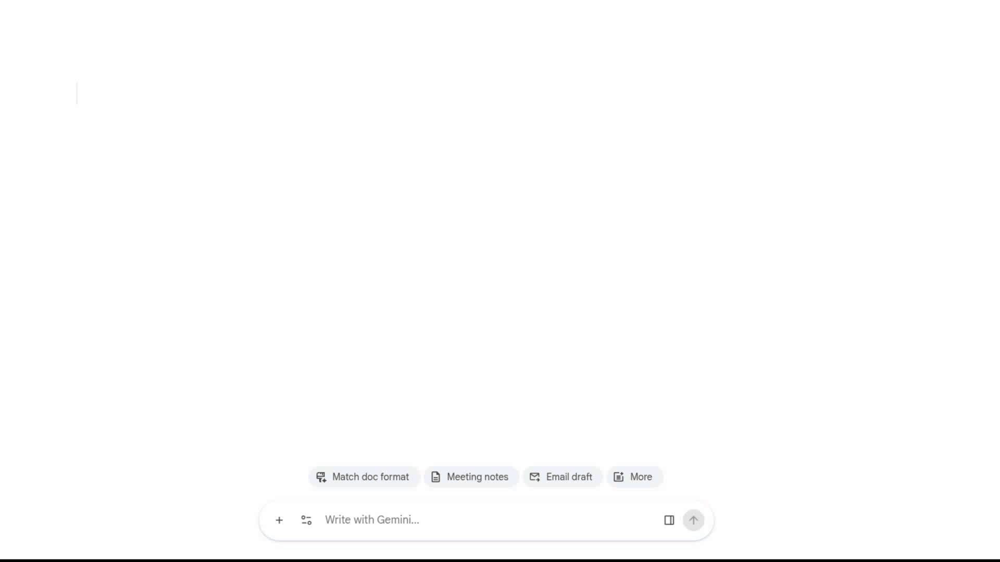
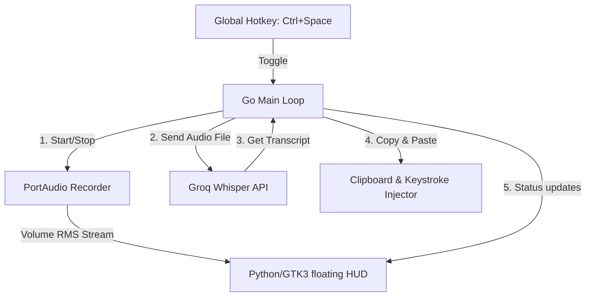

# Dictate

An AI-powered voice dictation application written in Go. It enables system-wide voice-to-text input by listening to your microphone, transcribing your speech using Groq's Whisper API, copying it to your clipboard, and automatically pasting it into the active text field.

The interface includes a beautiful **Wispr Flow-inspired floating HUD overlay** at the bottom-center of the screen, complete with real-time waveform visualizers and status transition animations.



---

## Features

- **Global Hotkey activation:** Toggle dictation instantly from anywhere using `Ctrl+Space`.
- **System-Wide Keystroke Injection:** Automatically copies transcriptions to the clipboard and pastes them directly into your focused window/application.
- **Ultra-Fast AI Transcriptions:** Uses Groq's `whisper-large-v3-turbo` model for near-instant speech-to-text conversions.
- **Wispr Flow-Style HUD Overlay:**
  - Floating, non-intrusive pill docked at the bottom-center of the screen.
  - Zero-focus design (does not steal input focus from the active text area).
  - Real-time animated audio waveform reacting to microphone volume.
  - Multi-state animations: *Listening* (recording wave), *Processing* (transcribing wave), *Success* (green checkmark fade-out), and *Error* (red exclamation fade-out).
  - Smooth fade-in and fade-out opacity transitions.
- **Cross-Platform Delivery Engine:** Supports native clipboard and paste execution across Wayland, X11, macOS, and Windows.

---

## Architecture Diagram



---

## Dependencies & Requirements

### System Libraries
- **PortAudio:** Required for microphone access and recording.
- **Python 3:** Required to execute the GTK3 floating HUD.
- **PyGObject (GTK3):** Python bindings for GTK.
- **GtkLayerShell (Wayland only):** Required to anchor the floating pill to the bottom center of the screen under Wayland sessions.

#### Installation commands (Linux)

- **Fedora/RHEL:**
  ```bash
  sudo dnf install portaudio-devel python3-gobject gtk-layer-shell
  ```
- **Ubuntu/Debian:**
  ```bash
  sudo apt-get install libportaudio2 portaudio19-dev python3-gi python3-gi-cairo gobject-introspection libgtk-layer-shell-dev
  ```

### Clipboard & Keystroke Injection Utilities
Based on your desktop environment:
- **Wayland (Linux):** `wl-copy` (clipboard) and `wtype` (virtual keyboard paste).
- **X11 (Linux):** `xclip` or `xsel` (clipboard) and `xdotool` (paste).
- **macOS:** Uses native `pbcopy` and `osascript`.
- **Windows:** Uses native PowerShell commands.

---

## Installation & Setup

1. **Clone the repository:**
   ```bash
   git clone https://github.com/your-username/dictate-go.git
   cd dictate-go
   ```

2. **Obtain a Groq API Key:**
   Get an API key from the [Groq Console](https://console.groq.com/) and set it in your environment:
   ```bash
   export GROQ_API_KEY="your_actual_api_key_here"
   ```

3. **Build and Install with Systemd (Linux Auto-Startup):**
   To automatically build the binary, install it to your user local bin folder, and register it as an auto-starting systemd user service:
   ```bash
   ./install.sh
   ```
   *Note: This script will preserve your current `GROQ_API_KEY` by saving it to `~/.config/dictate/env` so systemd can access it.*

   **Alternative Manual Build:**
   ```bash
   go build -o dictate
   ```

### Windows Build

1. **Install MSYS2** (if not already installed):
   ```powershell
   winget install --id MSYS2.MSYS2
   ```

2. **Install GCC, PortAudio, and pkg-config** via MSYS2's pacman:
   ```powershell
   C:\msys64\usr\bin\pacman.exe -S --noconfirm mingw-w64-ucrt-x86_64-gcc mingw-w64-ucrt-x86_64-portaudio mingw-w64-ucrt-x86_64-pkg-config
   ```

3. **Build** with the MSYS2 binaries in your PATH:
   ```powershell
   $env:PATH = "C:\msys64\ucrt64\bin;$env:PATH"
   go build -o dictate.exe
   ```

   For convenience, add `C:\msys64\ucrt64\bin` to your user or system `PATH` environment variable so you can build without setting it each time.

---

## Usage & Hotkey Configuration

Run the compiled executable:
```bash
./dictate
```

### Sway / Wayland Hotkey Integration
Because Wayland prohibits global keyboard hooks for security, you should configure your window manager to toggle the dictate state.
Under Wayland, `dictate` sets up a named pipe at `/tmp/dictate.pipe`.

Add the following to your window manager config (e.g. Sway config at `~/.config/sway/config`):
```text
bindsym Ctrl+Space exec echo toggle > /tmp/dictate.pipe
```

### X11, macOS, and Windows
On these systems, the application registers `Ctrl+Space` globally on startup. No extra setup is required.

---

## Codebase Map

- [main.go](file:///home/zephex/Github/dictate-go/main.go): The entry point. Handles the state machine (idle -> recording -> transcribing -> paste) and listens to keyboard shortcuts.
- [src/gui.py](file:///home/zephex/Github/dictate-go/src/gui.py): GTK3 implementation of the Wispr Flow-style floating HUD overlay, procedurally rendering waveforms using Cairo.
- [src/gui_manager.go](file:///home/zephex/Github/dictate-go/src/gui_manager.go): Manages the lifecycle of the Python HUD process and pipes status/volume details to it.
- [src/record.go](file:///home/zephex/Github/dictate-go/src/record.go): Manages audio stream initialization, WAV formatting, and computes the RMS volume to drive the visualizer wave amplitude.
- [src/api.go](file:///home/zephex/Github/dictate-go/src/api.go): Handles HTTP multipart requests to the Groq API.
- [src/deliver.go](file:///home/zephex/Github/dictate-go/src/deliver.go): Clipboard management and target paste/keystroke emulator utility.
- [src/status.go](file:///home/zephex/Github/dictate-go/src/status.go): Connects status changes with the systems visual GUI controller.
